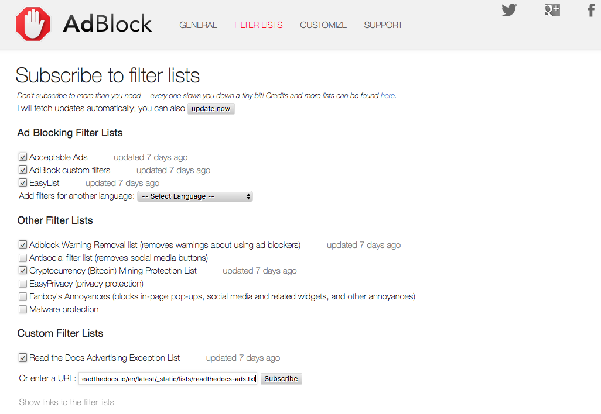
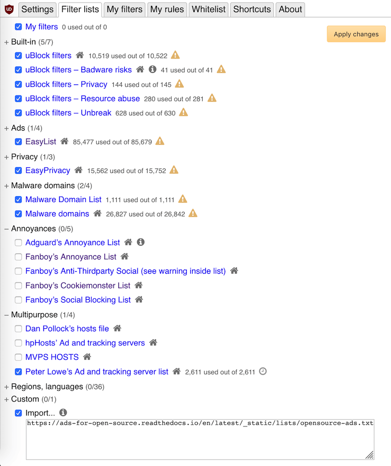

Installing Adblock Filter Lists
===============================

Adblock lists, whether filters that block additional items or allow
exceptions like the ones here, can be installed on every major
adblocker. Here are the installation steps on the three biggest adblockers.

Installing on AdblockPlus
-------------------------

.. figure:: _static/img/install-adblockplus.png
   :scale: 33 %
   :align: right
   :alt: Installing a filter list on AdblockPlus

   Installing on AdblockPlus

The easiest way to install these lists on AdblockPlus is to use AdblockPlus'
URL listener for subscribing to new lists:

* Click this link for the `Open Source Ads List`_
  and confirm by hitting the "Yes, use this filter list" button
* Or click this link for the `Read the Docs Ads List`_
  (a subset of the first list that only allows ads on Read the Docs)
  and confirm by hitting the "Yes, use this filter list" button

.. _Open Source Ads List: abp:subscribe?location=https://ads-for-open-source.readthedocs.io/en/latest/_static/lists/opensource-ads.txt&title=Open%20Source%20Ads%20Exceptions
.. _Read the Docs Ads List: abp:subscribe?location=https://ads-for-open-source.readthedocs.io/en/latest/_static/lists/readthedocs-ads.txt&title=Read%20the%20Docs%20Ads%20Exceptions

Alternatively, adding filter lists on AdblockPlus can be done in just a few steps:

* Click on the ABP extension icon on your browser and choose "Options".
* Under the "advanced" tab, click the
  "Add a new filter list"
* Enter the URL of the list you want to subscribe to
  (`Open Source Ads`_, `Read the Docs Ads`_), give it a name, and
  lastly click the "Add a filter list" button.

Installing on Adblock
---------------------

   Installing on Adblock

Installing filter lists on Adblock is similar to the manual process on
AdblockPlus. Here are the steps:

* Click on the Adblock extension icon on your browser.
* Under the "filter lists" tab in the "Custom Filter Lists" section,
  enter the URL of the list you want to subscribe to
  (`Open Source Ads`_, `Read the Docs Ads`_) and
  lastly click the "Subscribe" button.

Installing on uBlock Origin
---------------------------

   Installing on uBlock Origin

uBlock Origin is also just a couple of steps:

* Click on the uBlock Origin extension icon on your browser.
* Click the slider / settings icon to open the "Dashboard".
* Under the "Filter Lists" tab, scroll to the bottom where it says "Custom" and click the "Import" checkbox to reveal the custom URL textbox.
* Enter the URL of the list you want to subscribe to
  (`Open Source Ads`_, `Read the Docs Ads`_) in the textbox and lastly click the "Apply changes" button in the upper right.

.. _Open Source Ads: https://ads-for-open-source.readthedocs.io/en/latest/_static/lists/opensource-ads.txt
.. _Read the Docs Ads: https://ads-for-open-source.readthedocs.io/en/latest/_static/lists/readthedocs-ads.txt
